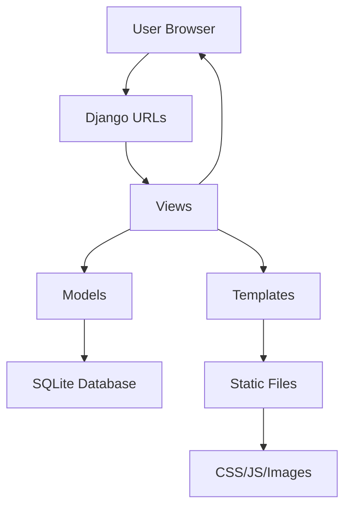

# Design Document: Jeykhan Portfolio Website

## Overview

The Jeykhan portfolio website is a professional personal website showcasing expertise in restaurant management and music training. Built using Django's MVT (Model-View-Template) architecture, the site provides a clean, responsive interface with prominent contact functionality and comprehensive service presentation.

The design emphasizes simplicity and professionalism, ensuring visitors can quickly understand the offered services and easily make contact. The site serves as both a digital business card and a service showcase for potential clients in the culinary and music industries.

## Architecture

### High-Level Architecture

The application follows Django's MVT (Model-View-Template) pattern:



### Technology Stack

- **Frontend**: HTML5, CSS3, JavaScript (ES6+)
- **Backend**: Django 4.2+ (Python web framework)
- **Database**: SQLite (default Django database)
- **Static Files**: Django's static file handling
- **Deployment**: Standard Django deployment practices

### Project Structure

```
jeykhan_portfolio/
├── manage.py
├── jeykhan_portfolio/
│   ├── __init__.py
│   ├── settings.py
│   ├── urls.py
│   └── wsgi.py
├── portfolio/
│   ├── __init__.py
│   ├── admin.py
│   ├── apps.py
│   ├── models.py
│   ├── views.py
│   ├── urls.py
│   └── migrations/
├── templates/
│   ├── base.html
│   ├── home.html
│   ├── services.html
│   └── about.html
└── static/
    ├── css/
    ├── js/
    └── images/
```

## Components and Interfaces

### Django Applications

#### Portfolio App

The main application containing all portfolio functionality:

- **Models**: Content management for services, experience, and contact information
- **Views**: Request handling and template rendering
- **Templates**: HTML presentation layer
- **Static Files**: CSS, JavaScript, and image assets

### Models

#### Service Model

```python
class Service(models.Model):
    title = models.CharField(max_length=100)
    category = models.CharField(max_length=50)  # 'restaurant' or 'music'
    description = models.TextField()
    icon = models.CharField(max_length=50)  # CSS class for icon
    is_active = models.BooleanField(default=True)
    order = models.IntegerField(default=0)
```

#### Experience Model

```python
class Experience(models.Model):
    title = models.CharField(max_length=100)
    category = models.CharField(max_length=50)
    description = models.TextField()
    years_experience = models.IntegerField()
    is_featured = models.BooleanField(default=False)
    order = models.IntegerField(default=0)
```

#### ContactInfo Model

```python
class ContactInfo(models.Model):
    phone_number = models.CharField(max_length=20)
    email = models.EmailField(blank=True)
    address = models.TextField(blank=True)
    is_active = models.BooleanField(default=True)
```

### Views

#### Home View

- Displays hero section with contact button
- Shows featured services and experience highlights
- Renders contact information prominently

#### Services View

- Lists all active services by category
- Provides detailed service descriptions
- Maintains consistent contact access

#### About View

- Showcases professional background
- Highlights experience in both fields
- Presents credibility and expertise

### Templates

#### Base Template

- Common HTML structure and navigation
- Responsive meta tags and CSS framework
- JavaScript includes for interactive elements

#### Component Templates

- Contact button component with tel: link
- Service card components
- Experience showcase components

### Static Files

#### CSS Structure

- **main.css**: Core styles and layout
- **responsive.css**: Media queries for different screen sizes
- **components.css**: Reusable component styles

#### JavaScript Functionality

- **main.js**: Core interactive functionality
- **contact.js**: Contact button behavior and validation
- **responsive.js**: Mobile-specific enhancements

## Data Models

### Service Management

Services are categorized into two main types:

- **Restaurant Management**: Culinary consulting, operations management
- **Music Training**: Singer development, vocal coaching

Each service includes:

- Title and detailed description
- Category classification
- Display order for consistent presentation
- Active/inactive status for content management

### Experience Tracking

Professional experience is organized by:

- Field of expertise (restaurant/music)
- Years of experience
- Featured status for homepage highlights
- Detailed descriptions of achievements

### Contact Information

Centralized contact management:

- Primary phone number for tel: links
- Optional email and address information
- Active status for easy updates

## Correctness Properties

_A property is a characteristic or behavior that should hold true across all valid executions of a system-essentially, a formal statement about what the system should do. Properties serve as the bridge between human-readable specifications and machine-verifiable correctness guarantees._

### Property-Based Testing Analysis

Based on the requirements analysis, the following properties ensure system correctness:

**Property 1: Contact Button Functionality**
_For any_ device type and screen size, when the contact button is clicked, the system should initiate the correct tel: link behavior and maintain button visibility and accessibility
**Validates: Requirements 1.2, 1.3**

**Property 2: Service Description Completeness**
_For any_ service category in the system, each service should have a non-empty description field that provides meaningful information
**Validates: Requirements 2.4**

**Property 3: Responsive Design Consistency**
_For any_ screen size within the supported range (mobile, tablet, desktop), the system should maintain proper layout, readability, and functionality
**Validates: Requirements 4.1, 4.2**

**Property 4: Performance and Compatibility Standards**
_For any_ modern web browser and standard internet connection, pages should load within 3 seconds and display correctly
**Validates: Requirements 5.3, 5.4**

**Property 5: SEO Implementation**
_For any_ page in the system, proper SEO elements (meta tags, semantic HTML, structured data) should be present and valid
**Validates: Requirements 5.5**

**Property 6: Content Management Integrity**
_For any_ content update made through the admin interface, changes should be reflected immediately on the frontend while maintaining data integrity
**Validates: Requirements 6.2, 6.4, 6.5**

## Error Handling

### User Input Validation

- **Phone Number Format**: Validate phone number format in admin interface
- **Content Length**: Ensure service descriptions meet minimum length requirements
- **Image Upload**: Validate image file types and sizes for portfolio content

### System Error Handling

- **Database Connection**: Graceful handling of database connectivity issues
- **Static File Loading**: Fallback mechanisms for missing CSS/JS files
- **Template Rendering**: Error pages for missing templates or data

### Browser Compatibility

- **Feature Detection**: JavaScript feature detection for older browsers
- **CSS Fallbacks**: Progressive enhancement for CSS features
- **Tel Link Support**: Graceful degradation for browsers without tel: support

## Testing Strategy

### Dual Testing Approach

The testing strategy employs both unit testing and property-based testing to ensure comprehensive coverage:

**Unit Tests**: Focus on specific examples, edge cases, and integration points

- Specific service content validation
- Admin interface functionality
- Template rendering with sample data
- Contact button behavior on specific devices

**Property Tests**: Verify universal properties across all inputs using Django's testing framework with Hypothesis for property-based testing

- Minimum 100 iterations per property test
- Each test tagged with: **Feature: jeykhan-portfolio, Property {number}: {property_text}**
- Comprehensive input coverage through randomization

### Testing Configuration

**Property-Based Testing Library**: Hypothesis (Python property-based testing library)

- Integrates seamlessly with Django's test framework
- Provides generators for web-specific data types
- Supports database testing with Django models

**Test Organization**:

- Unit tests validate concrete examples and edge cases
- Property tests verify universal correctness properties
- Integration tests ensure component interaction
- Performance tests validate loading time requirements

**Test Data Management**:

- Fixtures for consistent test data
- Factory classes for generating test objects
- Database isolation between test runs
- Static file handling in test environment

### Coverage Requirements

Each correctness property must be implemented by a single property-based test with proper tagging and minimum 100 iterations. Unit tests complement property tests by covering specific scenarios and edge cases that demonstrate correct behavior.
